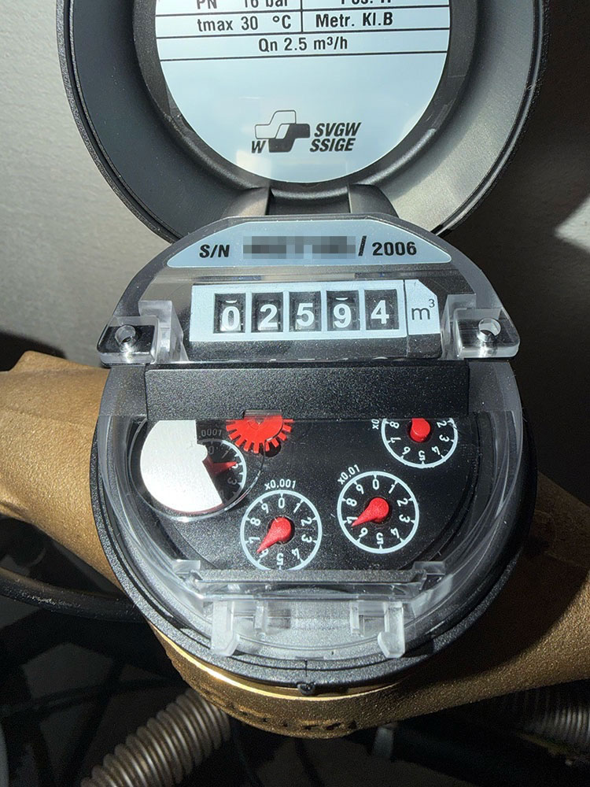
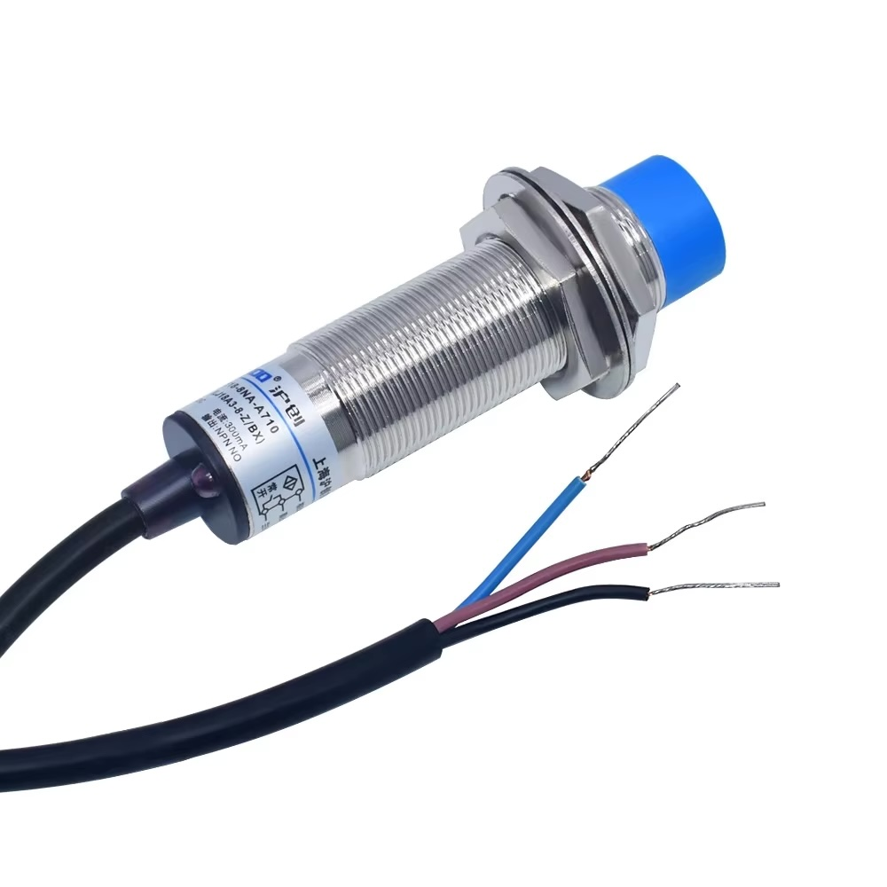
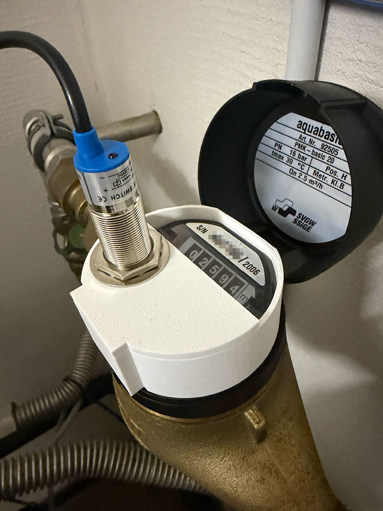
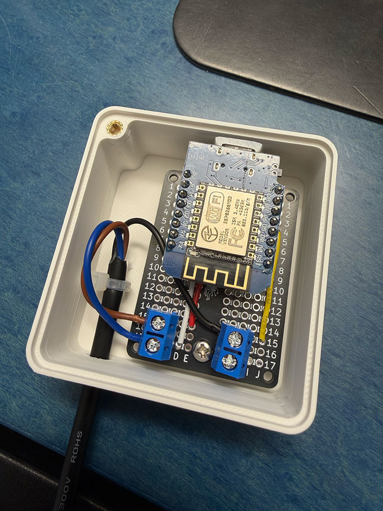
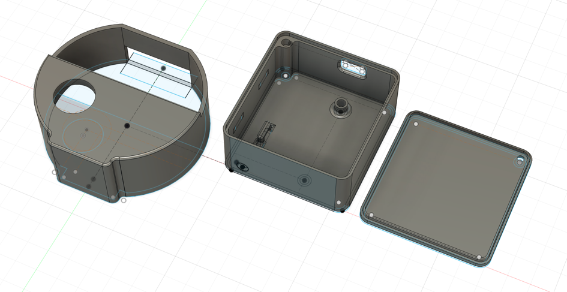

This is my solution to monitor my home's water usage at very low cost, and get it tracked by the
Energy Dashboard in Home Assistant, by reading my analog water meter:

<p align="center">
   
</p>

There are other projects that exist to measure your water meter. ESP32 has even the capability to run
[machine-vision software](https://github.com/jomjol/AI-on-the-edge-device) to decode the dials on your
meter, and parse them into data that Home Assistant can understand, but it was way too complex to start
with and trying to use a cheap proximity sensor (inductive sensor) proved to be the perfect match:

<p align="center">
   
</p>


## Context

I own a multi-jet turbine meter for cold water
[aquabasic® PMK-basic](https://ch.integra-metering.com/fr/product/aquabasic-pmk-basic/) which is
widely used in Switzerland. 

The turbine meter is featuring a rotary meter in cubic meter, and 4 analog dials showing hundreds of
liters (×0.1), tens of liters (×0.01), liters (×0.001), and deciliters (×0.0001). That last dial is
the one that is featuring a semi-circular metal disc that we aim at detecting thanks to the inductive
sensor. 1 rotation cycle = 1 liter, thus measuring each liter consumption.

<p align="center">
  
  
</p>


## Hardware

- 1× Proximity sensor [NPN NO LJ18A3-8-Z/BX-5V](https://de.aliexpress.com/item/1005004867517992.html)
- 1× WeMos D1 Mini TYPE-C ESP8266 ESP-12F
- 1× Mini prototype board from [uPesy](https://www.upesy.com/products/upesy-protoboard-breadboard-mini)
- 3× Threaded inserts M3 (2×5mm height for the board, 1×4mm height for the cover)
- 3× Cross round Phillips pan head screw bolt M3, length 6mm
- Straight pin PCB screw terminal block connector (I used 2× KF301-2P, but you could easily get a 1× KF301-3P)

**Note:** Be sure to buy a LJ18A3 sensor, and make sure it's a 5V version so that it can be powered
directly from the ESP.


## Wiring

| Proximity Sensor LJ18A3-8-Z/BX | ESP8266 (ESP32) |
|--------------------------------|-----------------|
| Black                          | D6              |
| Orange/Pink/Brown              | 5V (VIN)        |
| Blue                           | Ground (G/GRN)  |


## Code

```yaml
esphome:
  name: water-meter
  friendly_name: water-meter
  on_boot:
    then:
      - globals.set:
          id: data_was_restored
          value: 'true'
      - pulse_meter.set_total_pulses: 
          id: water_pulse_meter
          value: !lambda 'return id(water_meter_total);'

esp8266:
  board: esp01_1m
  restore_from_flash: true

preferences:
  flash_write_interval: 5min

globals:
  - id: water_meter_total
    type: int
    restore_value: yes
    initial_value: '0'
  - id: data_was_restored
    type: bool
    initial_value: '0'

# Enable logging
logger:

# Enable Home Assistant API
api:
  encryption:
    key: "--redacted--"
  actions:
    - action: set_total_liters
      variables:
        new_total_liters: int
      then:
        - pulse_meter.set_total_pulses:
            id: water_pulse_meter
            value: !lambda 'return new_total_liters;'

ota:
  - platform: esphome
    password: "--redacted--"

wifi:
  ssid: !secret wifi_ssid
  password: !secret wifi_password
  min_auth_mode: WPA

  # Enable fallback hotspot (captive portal) in case wifi connection fails
  ap:
    ssid: "Water-Meter Fallback Hotspot"
    password: "--redacted--"

captive_portal:

sensor:
  - platform: pulse_meter
    pin: GPIO12
    name: "Water Meter Flow"
    id: water_pulse_meter
    unit_of_measurement: "liter/min"
    icon: "mdi:water"
    total:
      name: "Water Meter Total"
      id: total_water_consumption
      unit_of_measurement: "m³"
      accuracy_decimals: 3
      device_class: water
      state_class: total_increasing
      on_value:
        then:
          - if:
              # This avoids overriding the total_water_consumption global
              # before the value is restored by on_boot
              condition:
                lambda: 'return id(data_was_restored);'
              then:
                lambda: 'id(water_meter_total) = id(total_water_consumption).raw_state;'
      filters:
        - multiply: 0.001
```

**Note:** In order to preset the total number of your counter, you can open
Home Assistant > Parameters > Developer Tools > Actions and make use of the API action
defined in the YAML definition.


## 3D-Printed Mount and Enclosure

<p align="center">
   
</p>

I designed the mount and enclosure in Autodesk Fusion. STL file [aquabasic.stl](aquabasic.stl)
contains everything you need.

**Hint:** You should print the water meter mount upside down to lower the number of supports
required.


## Additional Reading

Some additional useful links I used (or could have used) for this project:

- [Build a cheap water usaage sensor using ESPhome and a proximity sensor](https://www.pieterbrinkman.com/2022/02/02/build-a-cheap-water-usage-sensor-using-esphome-home-assistant-and-a-proximity-sensor/)
- [3D-printable adapters for other water meter brands](https://www.printables.com/tag/watermeter?lang=en)
